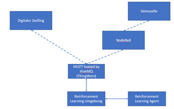

# RL4Demozelle
___
This project describes the usage of RL for the demonstration cell for conveyor belt speed optimization. For the RL environment a custom environment based on the OpenAi Gym library is created. The used RL algorithms to maximize the reward functions are from the library PyTorch. As communcation protocoll a MQTT-Broker was set up. The broker communicates with a Unity-based simulation of the demonstration cell.

The code provides a subscriber client class to connect to the MQTT-Broker and to subscribe data from the Unity simulation. It additionally provides a publisher class to connect to the broker an to publish data, which is used in the Unity simulation.
A clear overview about the used data can be found here: XXXX. An overview about the topic structure used for MQTT can be found here: XXXX.

In the following you can view a reference architecture currently used for this project.

  

## Information about the used packages
- As MQTT Python client library paho-mqtt 1.6.1 is used
- For the RL environment gym 0.26.2 is used
- For the learning algorithms PyTorch (torch 2.1.2) is used
- For visualization matplotlib 3.8.2 is used
- As ssl module ssl 1.16 is used